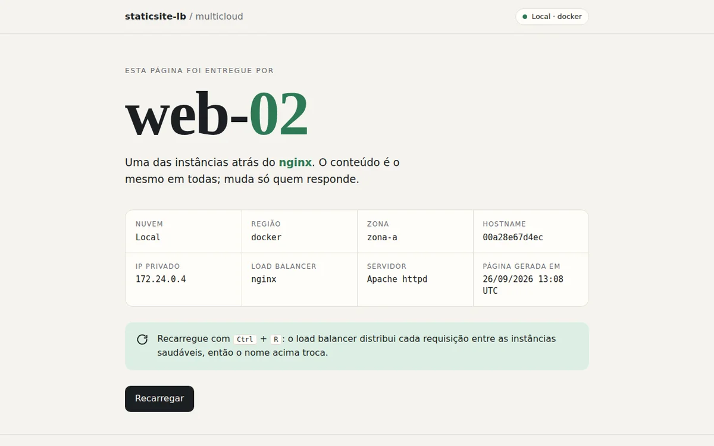
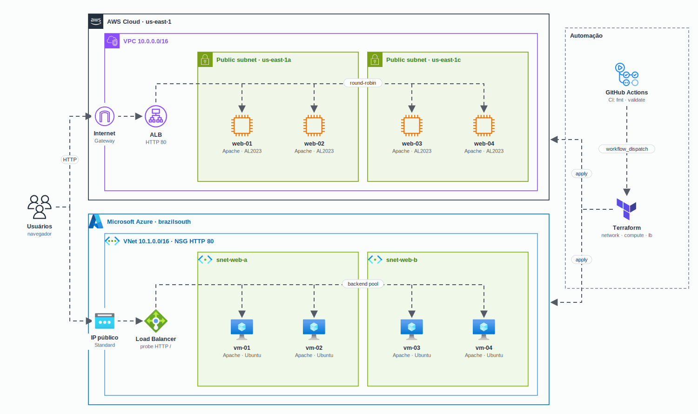

<h1 align="center">
  Lab Multicloud com Terraform: site estático com load balancer na AWS e na Azure
</h1>

<p align="center">
  
</p>

<p align="center">
  <a href="https://skillicons.dev">
    
  </a>
</p>

## Qual a finalidade do projeto?

Laboratório de estudo de **Terraform multicloud**, que nasceu dos estudos na graduação em Cloud da FIAP. A ideia é subir **a mesma aplicação nas duas nuvens**: um site estático servido por **4 servidores web atrás de um load balancer**, uma vez na **AWS** e outra na **Azure**, com o código organizado do mesmo jeito nas duas.

Cada nuvem tem a sua raiz Terraform com **três módulos simétricos** (`network`, `compute` e `lb`). O site é uma página só, que cada servidor preenche no primeiro boot com os próprios dados (nome, região, zona, hostname e IP), então dá para ver o balanceamento acontecendo: a cada recarga, outra instância responde.

## Arquitetura

<p align="center">
  
</p>

## O que foi construído

### Módulos (iguais nas duas nuvens)

| Módulo | AWS (`terraform/aws`) | Azure (`terraform/azure`) |
|---|---|---|
| `network` | VPC, Internet Gateway, 2 subnets públicas (us-east-1a e us-east-1c), route table | VNet, 2 subnets, NSG com HTTP 80 (e SSH opcional) |
| `compute` | Security group, 4 EC2 Amazon Linux 2023 com Apache, IMDSv2 obrigatório | Availability set, 4 NICs, 4 VMs Ubuntu 22.04 com Apache, login só por chave SSH |
| `lb` | Application Load Balancer, target group com health check, listener HTTP 80 | IP público e Load Balancer Standard, probe HTTP, regra de entrada e regra de saída |

### Entradas principais

| AWS | Azure | Padrão |
|---|---|---|
| `instance_count` | `vm_count` | `4` |
| `instance_type` | `vm_size` | `t3.micro` / `Standard_B1s` |
| `public_subnets` | `subnets` | 2 subnets `/24` |
| `ssh_allowed_cidrs` | `ssh_allowed_cidrs` | `[]` (SSH fechado) |
| `key_name` | `admin_ssh_public_key` | opcional / obrigatório |
| · | `dns_label` | obrigatório (nome DNS do IP público) |

### Saídas

| Output | O que traz |
|---|---|
| `site_url` | URL do site pelo load balancer (DNS do ALB ou FQDN do IP público da Azure) |
| `instances` / `vms` | Mapa `nome => IP privado` dos 4 servidores |

### Segurança

| Ponto | Como ficou |
|---|---|
| Senha das VMs | Não existe: a Azure usa só chave SSH (`disable_password_authentication = true`) |
| SSH | Fechado por padrão nas duas nuvens; abre só para os CIDRs de `ssh_allowed_cidrs` |
| HTTP nas EC2 | Liberado só a partir do security group do ALB |
| Metadados da EC2 | IMDSv2 obrigatório (`http_tokens = "required"`) |
| Estado | Backend remoto com configuração parcial (`backend.hcl`, fora do git); `*.tfvars` e `*.tfstate` no `.gitignore` |
| Pipeline | `apply` e `destroy` só por disparo manual |

### Pipelines

| Workflow | Quando roda | O que faz |
|---|---|---|
| `ci.yml` | todo push e PR | `terraform fmt -check`, `init -backend=false` e `validate` na AWS e na Azure; `shellcheck` do script do site; sobe a simulação local e confere que as 4 instâncias respondem |
| `deploy.yml` | só `workflow_dispatch` | Escolhe a nuvem e a ação (`plan`, `apply` ou `destroy`) |

## Tecnologias utilizadas

- **Terraform** (`>= 1.5`) com os providers **AWS** (`>= 5.70`) e **AzureRM** (`>= 4.5`);
- **AWS:** VPC, EC2, Application Load Balancer;
- **Azure:** Virtual Network, NSG, Linux Virtual Machines, Load Balancer Standard;
- **Apache httpd** nas instâncias, configurado por **user data / cloud-init**;
- **HTML e CSS** puros no site (sem dependências externas, com tema escuro automático);
- **GitHub Actions** para CI e deploy manual;
- **Docker Compose + nginx** para a simulação local do balanceamento.

## Estrutura do repositório

```text
studies-lab-multicloud-terraform/
├── terraform/
│   ├── aws/
│   │   ├── versions.tf            # Providers e backend S3 (parcial)
│   │   ├── variables.tf · main.tf · outputs.tf
│   │   ├── terraform.tfvars.example · backend.hcl.example
│   │   └── modules/
│   │       ├── network/           # VPC, IGW, subnets, route table
│   │       ├── compute/           # SG, EC2 e user-data.sh.tftpl
│   │       └── lb/                # ALB, target group, listener
│   └── azure/
│       ├── versions.tf            # Provider e backend azurerm (parcial)
│       ├── variables.tf · main.tf · outputs.tf
│       ├── terraform.tfvars.example · backend.hcl.example
│       └── modules/
│           ├── network/           # VNet, subnets, NSG
│           ├── compute/           # Availability set, NICs, VMs e cloud-init.sh.tftpl
│           └── lb/                # IP público, LB, probe, regras
├── site/
│   ├── index.html                 # Página com marcadores {{...}}
│   └── render.sh                  # Preenche os marcadores no boot
├── local/
│   ├── docker-compose.yml         # 4 Apache + nginx em round-robin
│   └── nginx.conf
├── .github/workflows/             # ci.yml e deploy.yml
└── docs/                          # arch.gif e demo.webp
```

## Fluxo de funcionamento

1. O Terraform lê `site/index.html` e `site/render.sh` e embute os dois (em base64) no user data de cada EC2 e no `custom_data` de cada VM.
2. No primeiro boot, o script instala o Apache, consulta o serviço de metadados da nuvem (IMDSv2 na AWS, IMDS na Azure) para saber região e zona, e roda o `render.sh`, que troca os marcadores pelo nome, hostname e IP da máquina.
3. O load balancer checa a saúde de cada servidor com `GET /` na porta 80 e só manda tráfego para os saudáveis.
4. O usuário abre o `site_url`; a cada requisição o balanceador escolhe um servidor, e a página mostra qual respondeu.
5. Na Azure as VMs não têm IP público: entram pelo LB e saem para a internet (para o `apt`) pela regra de outbound do próprio LB.

## Como rodar

### Simulação local (sem conta em nuvem)

```bash
docker compose -f local/docker-compose.yml up -d --wait
# abra http://localhost:8080 e recarregue a página
docker compose -f local/docker-compose.yml down
```

Sobe 4 containers Apache com a mesma página, preenchida pelo mesmo `render.sh`, atrás de um nginx em round-robin fazendo o papel do load balancer. É daí que vem a demo do topo. A porta muda com `LOCAL_PORT=9090`.

### AWS

```bash
cd terraform/aws
cp backend.hcl.example backend.hcl            # bucket e tabela de lock do tfstate
cp terraform.tfvars.example terraform.tfvars
terraform init -backend-config=backend.hcl
terraform apply
terraform output site_url
```

### Azure

```bash
az login
export ARM_SUBSCRIPTION_ID="<id-da-assinatura>"
cd terraform/azure
cp backend.hcl.example backend.hcl            # storage account do tfstate
cp terraform.tfvars.example terraform.tfvars  # dns_label único
export TF_VAR_admin_ssh_public_key="$(cat ~/.ssh/id_ed25519.pub)"
terraform init -backend-config=backend.hcl
terraform apply
terraform output site_url
```

Para só testar sem backend remoto: `terraform init -backend=false`. Ao terminar: `terraform destroy`.

### Pelo GitHub Actions

O `deploy.yml` roda pela aba **Actions → Deploy (manual)**, escolhendo a nuvem e a ação. Ele usa o environment com o nome da nuvem e espera estes secrets:

| Secret / variável | Nuvem |
|---|---|
| `AWS_ACCESS_KEY_ID`, `AWS_SECRET_ACCESS_KEY`, `AWS_SESSION_TOKEN` | AWS |
| `ARM_CLIENT_ID`, `ARM_CLIENT_SECRET`, `ARM_TENANT_ID`, `ARM_SUBSCRIPTION_ID` | Azure |
| `ADMIN_SSH_PUBLIC_KEY` (secret) e `AZURE_DNS_LABEL` (variável) | Azure |
| `BACKEND_HCL`: conteúdo do `backend.hcl` da nuvem | as duas |

## Como validar a entrega

Sem credenciais (é o que o CI faz):

```bash
TF="docker run --rm -v $PWD:/w -w /w hashicorp/terraform:1.9"
$TF fmt -check -recursive
for c in aws azure; do
  docker run --rm -v "$PWD":/w -w /w/terraform/$c hashicorp/terraform:1.9 init -backend=false
  docker run --rm -v "$PWD":/w -w /w/terraform/$c hashicorp/terraform:1.9 validate
done
```

Simulação local: recarregar `http://localhost:8080` 8 vezes deve mostrar `web-01`, `web-02`, `web-03` e `web-04`.

Com a infraestrutura no ar:

- `terraform output site_url` devolve o endereço do ALB (AWS) ou `<dns_label>.brazilsouth.cloudapp.azure.com` (Azure);
- `curl -s <site_url> | grep -o 'web-<em>[0-9]*'` (ou `vm-`) muda de instância entre as chamadas;
- o target group da AWS e o probe da Azure mostram os 4 servidores saudáveis;
- a página mostra a região e a zona reais lidas do serviço de metadados;
- `terraform destroy` remove tudo ao final.

## Autor

**William Coelho** · RM 556336 · [@willtechdev](https://github.com/willtechdev)
